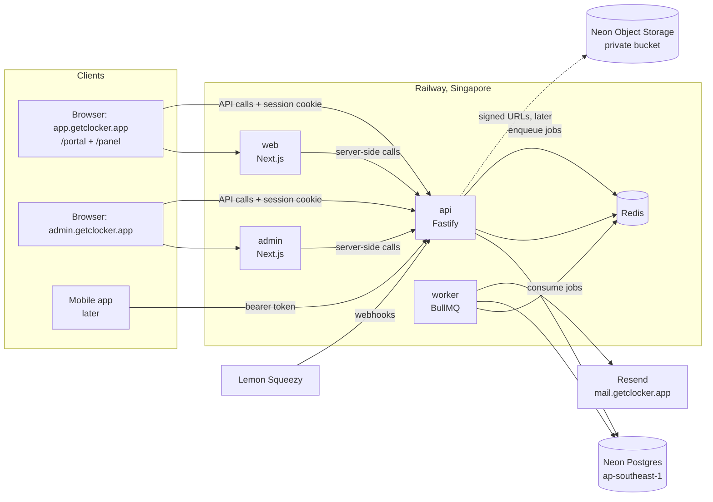

# Architecture overview

## System

Only the API and worker talk to the database. Frontends never hold database credentials.

## Audiences and identity

| Audience       | Where                                | Access decided by                                                  |
| -------------- | ------------------------------------ | ------------------------------------------------------------------ |
| Platform staff | `apps/admin` on admin.getclocker.app | `users.platform_role` (support / admin / superadmin), MFA required |
| Customers      | `/portal` in `apps/web`              | membership role `owner`, `admin` or `staff` in the active org      |
| End users      | `/panel` in `apps/web`               | membership role `member` in the active org                         |

- One account per email. A user can belong to many orgs with a different role in each.
- Platform roles are separate from org roles, so no customer action can grant platform access.
- Members join through email invites or bulk CSV import from the portal (Phase 3).

## API namespaces (target)

| Prefix         | Who                   | Notes                                   |
| -------------- | --------------------- | --------------------------------------- |
| `/health/*`    | platform              | liveness (Phase 0), readiness (Phase 1) |
| `/auth/*`      | everyone              | Better Auth (Phase 3)                   |
| `/v1/me/*`     | signed-in users       | profile, timezone override, my orgs     |
| `/v1/portal/*` | org owner/admin/staff | scoped to the active org                |
| `/v1/panel/*`  | org members           | scoped to the active org                |
| `/v1/admin/*`  | platform staff        | cross-tenant, audit-logged              |
| `/webhooks/*`  | providers             | signature-verified, no session          |

## Domains

| Host                        | Service                          |
| --------------------------- | -------------------------------- |
| app.getclocker.app          | web                              |
| admin.getclocker.app        | admin                            |
| api.getclocker.app          | api                              |
| `<org-slug>`.getclocker.app | web, per-org subdomains (later)  |
| mail.getclocker.app         | Resend sending domain (DNS only) |

`.app` is on the browsers' HSTS preload list, so every host is HTTPS-only. Session cookies are scoped to
`.getclocker.app` (Phase 3).

## Monorepo

| Path              | Purpose                                                                                     |
| ----------------- | ------------------------------------------------------------------------------------------- |
| `apps/api`        | Fastify API (`src/server.ts`) and worker (`src/worker.ts`), one image, two Railway services |
| `apps/web`        | Next.js: portal and panel                                                                   |
| `apps/admin`      | Next.js: platform admin                                                                     |
| `apps/mobile`     | reserved                                                                                    |
| `packages/shared` | Zod contracts, roles, timezone utilities                                                    |
| `packages/config` | tsconfig and ESLint presets                                                                 |

Tooling: pnpm workspaces link packages, and Turborepo runs tasks in dependency order with caching.
Dockerfiles use `turbo prune` so each image only contains its own app and dependencies.

## Environments

| Env        | Database                                     | Redis                   | Where                  |
| ---------- | -------------------------------------------- | ----------------------- | ---------------------- |
| Local      | Neon branch `dev`                            | Docker `redis:8-alpine` | Docker Compose         |
| Tests      | throwaway Neon branch per run (from Phase 1) | Docker or CI service    | local / GitHub Actions |
| Production | Neon branch `main`                           | Railway Redis           | Railway                |

## Current state (Phase 0)

Skeletons only: `GET /health/live`, a worker that connects to Redis, and web/admin pages showing API
status and timezone formatting. See [ROADMAP](../ROADMAP.md) for what each phase adds.
