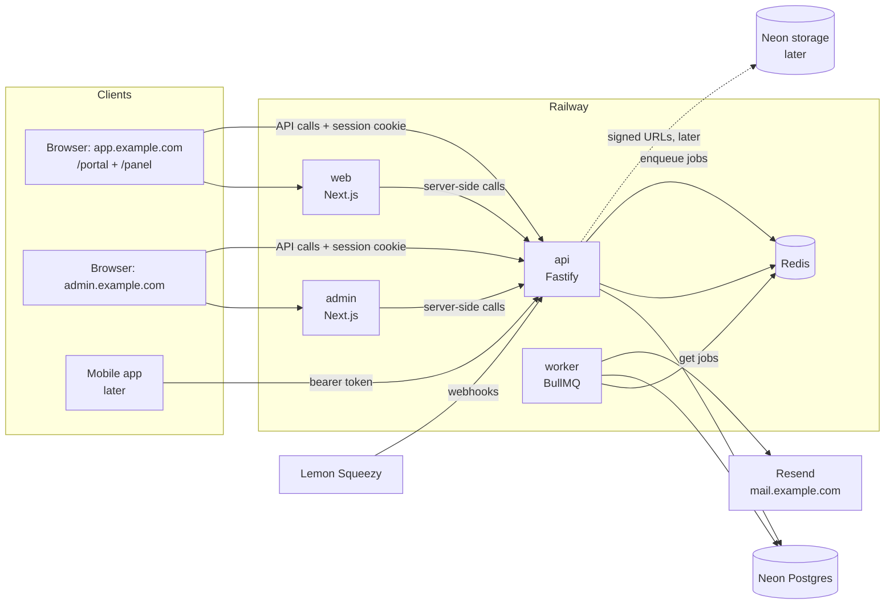

# Architecture overview

The examples on this page use `example.com`. Each product uses its own domain.

## System

Only the API and the worker connect to the database. The frontends do not have database credentials.

## Adapters

Each external service (database, storage, email, billing) has one adapter module.
The other code uses only the functions of the adapter. Thus a product can replace a service and
change only one module. Refer to [adapters.md](adapters.md).

## Audiences and identity

| Audience       | Where                             | Access decided by                                                  |
| -------------- | --------------------------------- | ------------------------------------------------------------------ |
| Platform staff | `apps/admin` on admin.example.com | `users.platform_role` (support / admin / superadmin), MFA required |
| Customers      | `/portal` in `apps/web`           | org role `owner`, `admin` or `staff` in the active org             |
| End users      | `/panel` in `apps/web`            | org role `member` in the active org                                |

- Each email address has one account. A user can be a member of many orgs, with a different role in each org.
- Platform roles are separate from org roles. Thus no customer action can give platform access.
- Members join through email invites or a CSV import from the portal (Phase 4).

## API namespaces (target)

| Prefix         | Who                   | Notes                                     |
| -------------- | --------------------- | ----------------------------------------- |
| `/health/*`    | platform              | liveness (Phase 0), readiness (Phase 2)   |
| `/auth/*`      | everyone              | Better Auth (Phase 4)                     |
| `/v1/me/*`     | signed-in users       | profile, zone override, my orgs           |
| `/v1/portal/*` | org owner/admin/staff | for the active org only                   |
| `/v1/panel/*`  | org members           | for the active org only                   |
| `/v1/admin/*`  | platform staff        | all tenants, each action in the audit log |
| `/webhooks/*`  | providers             | signature check, no session               |

## Domains

| Host                     | Service                                 |
| ------------------------ | --------------------------------------- |
| app.example.com          | web                                     |
| admin.example.com        | admin                                   |
| api.example.com          | api                                     |
| `<org-slug>`.example.com | web, one subdomain for each org (later) |
| mail.example.com         | Resend sending domain (DNS only)        |

Use HTTPS on all hosts. The session cookie domain is `.example.com` (Phase 4).

## Monorepo

| Path              | Purpose                                                                                     |
| ----------------- | ------------------------------------------------------------------------------------------- |
| `apps/api`        | Fastify API (`src/server.ts`) and worker (`src/worker.ts`). One image, two Railway services |
| `apps/web`        | Next.js: portal and panel                                                                   |
| `apps/admin`      | Next.js: platform admin                                                                     |
| `apps/mobile`     | Reserved                                                                                    |
| `packages/shared` | Zod contracts, roles, product identity, timezone utilities                                  |
| `packages/config` | tsconfig and ESLint presets                                                                 |

All workspace packages use the scope `@repo/*`. A product keeps this scope. Thus a product does not
rename packages, and changes from the starter merge easily.

Tools: pnpm workspaces link the packages. Turborepo runs the tasks in the dependency order and keeps a cache.
The Dockerfiles use `turbo prune`. Thus each image contains only its app and its dependencies.

## Environments

| Env        | Database                                                                   | Redis                   | Where                  |
| ---------- | -------------------------------------------------------------------------- | ----------------------- | ---------------------- |
| Local      | Neon branch `dev`                                                          | Docker `redis:8-alpine` | Docker Compose         |
| Tests      | Disposable local Postgres container, or a disposable Neon branch (Phase 2) | Disposable container    | local / GitHub Actions |
| Production | Neon branch `main`                                                         | Railway Redis           | Railway                |

## Current state (Phase 1)

The apps are skeletons: `GET /health/live`, a worker that connects to Redis, and web and admin pages
that show the API status and timezone formats. The product name comes from `APP_NAME` and
`NEXT_PUBLIC_APP_NAME`. Refer to the [ROADMAP](../ROADMAP.md) for the work of each phase.
